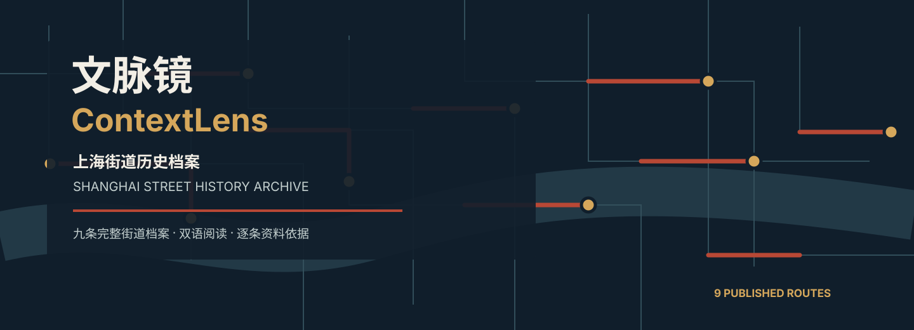

<div align="center">



<br>

[](#-published-street-catalogue)
[](#-one-complete-visitor-route)
[](#-evidence-system)
[](#-release-validation)

### Choose one completed Shanghai street dossier. Follow its names, people,
### buildings, events, images, maps, and sources in one coherent route.

**选择一条已完成的上海街道档案，沿着名称、人物、建筑、事件、影像、地图与资料来源，读懂它如何成为今天的样子。**

[Product](#-what-contextlens-does) · [Catalogue](#-published-street-catalogue) · [Evidence](#-evidence-system) · [Run locally](#-quick-start) · [Validation](#-release-validation)

</div>

---

## ✦ What ContextLens does

Historical street evidence is fragmented: one road can have several names,
events are catalogued separately from buildings, maps use different spatial
references, and attractive narratives can easily outrun their sources.

**ContextLens turns those fragments into a bilingual, source-aware street
history that visitors can read without leaving the platform—and verify when
they want to go deeper.**

The public product uses a **curated catalogue rather than unrestricted search**.
Every published street is required to complete the entire journey. Unsupported
or incomplete resolver candidates never open as empty public dossiers.

| Product promise | Concrete implementation |
|---|---|
| **Readable before technical** | Editorial overview and dated street history appear before the bibliography. |
| **Evidence attached to meaning** | Events, buildings, images, and maps explain why they matter to the selected street. |
| **One continuous route** | Catalogue → overview → names → chronology → visuals → map → sources → export. |
| **Bilingual by design** | Catalogue, navigation, interpretation, captions, and research notes support Chinese and English. |
| **No false completeness** | Only streets that pass the publication gate appear publicly. |

## ✦ One complete visitor route

```mermaid
flowchart LR
    A["01 · Choose a published street<br/>选择已完成街道"] --> B["02 · Read the overview<br/>理解街道主题"]
    B --> C["03 · Follow names through time<br/>追踪名称沿革"]
    C --> D["04 · Explore dated moments<br/>阅读历史节点"]
    D --> E["05 · Inspect images and maps<br/>观察影像与空间"]
    E --> F["06 · Open supporting sources<br/>核验资料依据"]
    F --> G["07 · Switch language or export<br/>切换语言或导出"]

    style A fill:#F2EEE5,stroke:#B84835,color:#172321
    style B fill:#F2EEE5,stroke:#B84835,color:#172321
    style C fill:#F2EEE5,stroke:#B84835,color:#172321
    style D fill:#DDE7E3,stroke:#2E5A50,color:#172321
    style E fill:#DDE7E3,stroke:#2E5A50,color:#172321
    style F fill:#E0E9ED,stroke:#315A73,color:#172321
    style G fill:#F3E4C7,stroke:#D5A75B,color:#172321
```



Each dossier contains up to seven reader-facing chapters:

1. **Street overview / 街道概览** — a concise editorial interpretation.
2. **Names through time / 名称沿革** — verified historical name periods.
3. **Street chronicle / 街道纪事** — dated events, buildings, institutions, and people.
4. **Visual archive / 街道影像** — rights-aware images with item-specific explanations.
5. **Street in the city / 街道与城市** — present-day orientation and historically relevant maps.
6. **Sources / 资料来源** — readable source contributions and original collection entrances.
7. **Reader export / 阅读版导出** — a printable version of the dossier.

## ✦ Published street catalogue

The current release contains **9 completed dossiers across 5 Shanghai
districts**, spanning waterfront, commercial, residential, literary,
institutional, and migration histories.

| Street dossier | Coverage | Historical lens | District |
|---|:---:|---|---|
| **霞飞路 / 淮海中路** · Avenue Joffre / Huaihai Middle Road | 1901–present | Six name periods, publishing, art, metropolitan life | Huangpu / Xuhui |
| **衡山路** · Hengshan Road | 1920–present | Avenue Pétain, apartments, lane housing, public institutions | Xuhui |
| **重庆南路** · South Chongqing Road | 1923–present | Lane compounds, apartments, residential change | Huangpu |
| **陕西南路** · South Shaanxi Road | 1920–present | Garden residences, lanes, historical renaming | Huangpu / Xuhui |
| **南京西路** · West Nanjing Road | 1932–present | Bubbling Well Road, commerce, hotels, civic culture | Huangpu / Jing'an |
| **多伦路** · Duolun Road | 1911–present | Darroch Road, literary culture, churches, revolutionary sites | Hongkou |
| **四川北路** · North Sichuan Road | 1925–present | Commerce, worker housing, apartments, revolutionary activity | Hongkou |
| **长阳路** · Changyang Road | 1903–present | Ward Road, civic institutions, Jewish refuge history | Hongkou / Yangpu |
| **外滩 / 中山东一路** · The Bund / East Zhongshan No. 1 Road | 1869–present | River infrastructure, finance, architecture, skyline | Huangpu |

> **Flagship demonstration:** enter through the catalogue, open **霞飞路 / 淮海中路**, follow its six documented name periods, read the 1927 and 1934 moments, inspect the visual archive, open the supporting sources, switch to English, and export the reader edition.

## ✦ Evidence system

<div align="center">

| 154 | 93 | 9 | 0 |
|:---:|:---:|:---:|:---:|
| **official records** | **preserved API responses** | **published dossiers** | **demo-seed records in the public path** |
| Shanghai Library snapshot | reproducible lineage | full-loop catalogue | deterministic evidence base |

</div>

### Primary historical evidence

Shanghai Library open data is the core evidence layer:

- road and place-name entities;
- Shanghai historical and cultural events;
- Shanghai outstanding historical buildings;
- people and institution authority records;
- bibliographic, periodical, and collection entrances where available.

### Chinese contextual sources

Municipal and district gazetteers, public heritage registers, district-history
materials, and other attributable Chinese institutional sources add local
historical context.

### Visual and spatial collections

- **Virtual Shanghai** and **Wikimedia Commons** — attributable historical and contemporary images;
- **Princeton University Library** — the 1943 *Plan of Shanghai*;
- **Library of Congress** and other public institutional collections — street imagery where relevant;
- **OpenStreetMap / OpenFreeMap** — present-day orientation.

Visuals provide spatial and material context. They are not silently promoted
into proof of a historical claim. Every displayable image records its title,
date, creator, provider, licence, attribution, source page, and evidence role.

## ✦ Publication gate

A street can appear in the catalogue only when all mandatory checks pass:

- [x] unambiguous public identity;
- [x] meaningful, dated chronological material;
- [x] sources attached to displayed historical claims;
- [x] no empty required chapter;
- [x] usable visual rights and attribution metadata;
- [x] working internal actions and practical source fallbacks;
- [x] valid Chinese and English content;
- [x] complete data and interaction regression route.

If any mandatory test fails, the street remains unpublished.

## ✦ Quick start

The packaged experience requires **Python 3.10+**. It does not require a model
key, Shanghai Library API key, or Node.js.

```bash
git clone https://github.com/StableTradeAtlas/ContextLens.git
cd ContextLens
./start-contextlens
```

Open **http://127.0.0.1:8765**.

| Platform | One-click launcher |
|---|---|
| macOS | `START_HERE_MAC.command` |
| Windows | `START_HERE_WINDOWS.bat` |
| Linux | `START_HERE_LINUX.sh` |

Use another port if needed:

```bash
CONTEXTLENS_PORT=8777 ./start-contextlens
```

### Frontend development

Node.js is needed only when changing the frontend:

```bash
npm ci
npm run check
npm run build
```

## ✦ Architecture

```text
ContextLens/
├── frontend/src/                 # bilingual catalogue and street dossier UI
├── app/
│   ├── catalog.py                # public publication manifest
│   ├── media_registry.py         # rights-aware visual registry
│   ├── place_investigation.py    # resolution and dossier pipeline
│   ├── official_snapshot.py      # Shanghai Library snapshot builder
│   ├── historical_maps.py        # map catalogue and precision boundaries
│   ├── storage.py                # evidence index
│   └── memory_web.py             # local HTTP application and API
├── data/processed/
│   └── shlibrary_official_snapshot.json
├── tests/                        # publication, evidence, media, and regressions
└── start.py
```

| Method | Endpoint | Purpose |
|---|---|---|
| `GET` | `/api/catalog` | Return the curated public catalogue |
| `GET` | `/api/health` | Report packaged evidence coverage and service health |
| `POST` | `/api/place/resolve` | Resolve a catalogue street identity |
| `POST` | `/api/investigations` | Build an evidence-bound dossier |
| `GET` | `/api/investigations/{id}` | Return progress or the completed dossier |

## ✦ Release validation

```bash
npm run check
npm run build
python3 tests/test_catalog_publication.py
PYTHONPATH=. python3 tests/test_media_registry.py
python3 tests/test_place_investigation.py
python3 tests/test_agent.py
python3 tests/test_gpu_artifacts.py
```

| Validation surface | Current release |
|---|:---:|
| TypeScript type check | ✅ Passed |
| Production frontend build | ✅ Passed |
| Nine-street publication gate | ✅ Passed |
| Media rights registry | ✅ Passed |
| Place-investigation regression | ✅ Passed |
| Evidence-agent smoke test | ✅ Passed |
| Core operation without an LLM | ✅ Supported |

## ✦ GPU-assisted bilingual retrieval

DKU Library funding supported one reproducible offline retrieval experiment on
a RunPod **NVIDIA RTX PRO 6000 Blackwell Server Edition**. BGE-M3 encoded the
nine published bilingual dossiers and evaluated 30 Chinese, English, and
mixed-language questions. The resulting graph now orders the three related
streets shown at the end of each dossier.

| Recorded result | Value |
|---|---:|
| Recall@1 | 0.70 |
| Recall@3 | 0.90 |
| Mixed Chinese–English Recall@3 | 1.00 |
| Peak allocated GPU memory | 5,052.98 MB |
| Measured model-run duration | 13.817 s |

The computation does **not** generate historical claims. Related routes remain
limited to the nine editorially reviewed dossiers, and the public website has
no live GPU dependency. See the [full GPU report](reports/gpu/contextlens_gpu_report.md)
and [reproduction scripts](gpu/README.md).

## ✦ Research and privacy boundaries

- The application does not request GPS, camera, microphone, or browser-history access.
- Query audit logs store irreversible hashes rather than raw addresses.
- Historical map precision is never overstated.
- Missing support is not replaced with a convenient but unrelated record.
- Optional model assistance is not required for the public experience.
- Credentials remain local and never enter frontend bundles or source URLs.

## ✦ Competition proposition

> **Search is easy. Historical traceability is the product.**

ContextLens gives visitors a designed way to read how a Shanghai street changed
and to open the material behind that account. It is public history that can be
examined, questioned, cited, and reused—not an automatically generated anecdote.

---

<div align="center">

### 文脉镜 ContextLens

**Shanghai Street History Archive · 上海街道历史档案**

`Shanghai Library open data` · `Bilingual public history` · `Traceable visual sources` · `Deterministic core`

</div>
