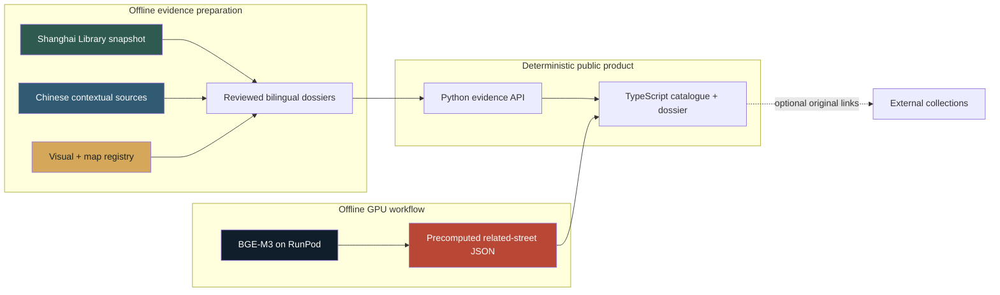

<div align="center">

# 文脉镜 ContextLens

### Shanghai Street History Archive · 上海街道历史档案

**Choose one completed Shanghai street dossier. Follow its names, people, buildings, events, images, maps, and sources in one coherent route.**

**选择一条已完成的上海街道档案，沿着名称、人物、建筑、事件、影像、地图与资料来源，读懂它如何成为今天的样子。**

[](#published-street-catalogue)
[](#the-complete-visitor-route)
[](#evidence-architecture)
[](#publication-gate-and-release-validation)

[What it is](#contextlens-in-30-seconds) · [Walkthrough](#product-walkthrough) · [Catalogue](#published-street-catalogue) · [Evidence](#evidence-architecture) · [GPU work](#gpu-assisted-bilingual-retrieval) · [Run locally](#quick-start)

<table>
  <tr>
    <td width="58%"></td>
    <td width="42%"></td>
  </tr>
</table>

</div>

---

## ContextLens in 30 seconds

ContextLens is a **bilingual, evidence-backed archive of Shanghai street
histories**. Visitors select one of nine completed dossiers and follow the
street through documented names, dated events, buildings, people, images,
maps, and readable source entries—without losing the historical narrative.

文脉镜是一座**中英双语、以资料为依据的上海街道历史档案**。访客从九条已完成
的街道中选择一条，在同一条阅读路径中追踪路名沿革、历史事件、建筑、人物、
影像、地图与资料来源。

The project deliberately does **not** promise an automatically generated story
for every typed street. It publishes only dossiers that pass a complete-route
standard: no empty required sections, unsupported dates, broken primary
actions, or untraceable visuals.

> **The central proposition:** street history should be readable like a story,
> but inspectable like research.

### Why this approach is different

| Common street-story approach | ContextLens |
|---|---|
| Accept a broad query, even when evidence is thin | Offer a curated catalogue of completed dossiers |
| Present an attractive narrative first | Reconstruct a reviewed history with its supporting material |
| Collect citations at the end | Explain what each source contributes to the relevant chapter |
| Use images as atmosphere | State what every visual shows, why it matters, and where it comes from |
| Recommend content by tags or popularity | Rank related reviewed dossiers through offline bilingual semantic comparison |
| Hide incomplete cases behind generic output | Keep incomplete streets unpublished until the full route passes |

## Product walkthrough

<table>
  <tr>
    <td width="33%"><strong>01 · Choose / 选择</strong><br><sub>The catalogue contains only dossiers that complete the public route.</sub></td>
    <td width="33%"><strong>02 · Read / 阅读</strong><br><sub>Names and dated moments form one continuous street history.</sub></td>
    <td width="33%"><strong>03 · Verify and continue / 核验与延伸</strong><br><sub>Source entries support the account; GPU ranking leads to another reviewed dossier.</sub></td>
  </tr>
  <tr>
    <td></td>
    <td></td>
    <td></td>
  </tr>
</table>

## The complete visitor route


Each dossier can contain seven reader-facing chapters:

1. **Street overview / 街道概览** — a concise historical interpretation.
2. **Names through time / 名称沿革** — verified name periods in sequence.
3. **Street chronicle / 街道纪事** — dated events, buildings, institutions, and people.
4. **Visual archive / 街道影像** — rights-aware material with item-specific explanations.
5. **Street in the city / 街道与城市** — present-day orientation and a relevant historical map.
6. **Sources / 资料来源** — readable contributions and original collection entrances.
7. **Continue or export / 延伸阅读或导出** — related reviewed dossiers and a printable edition.

## Published street catalogue

<div align="center">
  
</div>

The release contains **nine complete dossiers across five Shanghai districts**.
The catalogue spans commercial, residential, literary, institutional,
migration, financial, and waterfront histories rather than repeating one
central-city archetype.

| Street dossier | Coverage | Historical lens | District |
|---|:---:|---|---|
| **霞飞路 / 淮海中路** · Avenue Joffre / Huaihai Middle Road | 1901–present | Six name periods, publishing, art, metropolitan life | Huangpu / Xuhui |
| **衡山路** · Hengshan Road | 1920–present | Avenue Pétain, apartments, lane housing, public institutions | Xuhui |
| **重庆南路** · South Chongqing Road | 1923–present | Lane compounds, apartments, residential change | Huangpu |
| **陕西南路** · South Shaanxi Road | 1920–present | Garden residences, lanes, historical renaming | Huangpu / Xuhui |
| **南京西路** · West Nanjing Road | 1932–present | Bubbling Well Road, commerce, hotels, civic culture | Huangpu / Jing'an |
| **多伦路** · Duolun Road | 1911–present | Darroch Road, literary culture, churches, revolutionary sites | Hongkou |
| **四川北路** · North Sichuan Road | 1925–present | Commerce, worker housing, apartments, revolutionary activity | Hongkou |
| **长阳路** · Changyang Road | 1903–present | Ward Road, civic institutions, Jewish refuge history | Hongkou / Yangpu |
| **外滩 / 中山东一路** · The Bund / East Zhongshan No. 1 Road | 1869–present | River infrastructure, finance, architecture, skyline | Huangpu |

The map is an orientation graphic, not a survey map. Approximate positions are
used here because the README explains catalogue scope rather than historical
parcel-level geography.

## Flagship demonstration: 霞飞路 / 淮海中路

The flagship dossier makes the project’s argument visible in one route.

### Six documented name periods

| Period | Name |
|---:|---|
| 1901–1906 | 西江路 · Rue de Sikiang |
| 1906–1915 | 宝昌路 · Route Paul Brunat |
| 1915–1943 | 霞飞路 · Avenue Joffre |
| 1943–1945 | 泰山路 |
| 1945–1950 | 林森中路 |
| 1950–present | 淮海中路 · Huaihai Middle Road |

### Two evidence-backed historical moments

- **1927 — Liu Haisu’s exhibition / 刘海粟近作展览会.** Shanghai Library’s
  historical-event record places the exhibition at Shangxian Hall on Avenue
  Joffre and preserves references to *Shibao* and *Shanghai Pictorial*.
- **1934 — Kangjian Bookstore / 康健书局.** The event record identifies the
  bookstore at 436 Avenue Joffre, records its founding year, and notes that it
  remained active until 1950.

### Recommended live-demo sequence

1. Open the catalogue and select **霞飞路 / 淮海中路**.
2. Follow the six name stages from 1901 to the present.
3. Read the 1927 exhibition and 1934 bookstore entries.
4. Inspect the 1930s street image and its rights metadata.
5. Open one supporting Shanghai Library source entry.
6. Show the three GPU-ranked related dossiers.
7. Switch the entire interface to English.
8. Export the reader edition.

The intended conclusion is concrete: **one street becomes an interface for
reading Shanghai’s administrative, cultural, commercial, and spatial history.**

## Evidence architecture

<div align="center">
  
</div>

### Evidence base at a glance

| 154 | 93 | 9 | 0 |
|:---:|:---:|:---:|:---:|
| **packaged official records** | **preserved API responses** | **published dossiers** | **seed/demo records in the public evidence path** |
| Shanghai Library snapshot | reproducible lineage | complete catalogue routes | deterministic production data |

### Source hierarchy

| Source class | What it contributes | How it is used |
|---|---|---|
| **Shanghai Library open data** | Road entities, historical events, historical buildings, people, institutions, bibliographic entrances | Primary identity and historical evidence |
| **Chinese institutional sources** | Gazetteers, municipal or district history, heritage registers, museum material | Local context and corroboration |
| **International visual and cartographic collections** | Historical photographs and maps from public institutional collections | Visual and spatial interpretation with attribution |
| **Contemporary geographic infrastructure** | OpenStreetMap / OpenFreeMap orientation | Present-day location, never proof of a historical claim |

Shanghai Library open data remains the project’s evidentiary foundation. The
packaged snapshot allows the demonstration to remain reproducible if a live
provider is temporarily unavailable. Each external entry preserves enough
metadata to locate the collection again when an automated request is blocked
or redirected.

### One claim, one inspectable relationship

```text
Claim
Kangjian Bookstore was founded in 1934 at 436 Avenue Joffre.

Supporting record
Shanghai Historical and Cultural Events Knowledge Base

Displayed relationship
Dated event + direct street address

Visitor action
View supporting source → read the contribution → open the collection entrance
```

The visitor does not need to read raw JSON to understand the history. At the
same time, the interface does not make an external link substitute for an
on-page explanation.

### Visual-rights policy

Every embedded image records:

- title and date;
- creator where known;
- holding institution or provider;
- licence and required attribution;
- original source page;
- whether the item provides context or direct evidence;
- a street-specific explanation of why it is shown.

For example, the dossier’s 1930s Avenue Joffre photograph is presented with its
Wikimedia Commons record, dating note, creator status, licence information,
and an explanation of the streetscape detail it helps the reader observe.
Material without a defensible embedding right is referenced rather than copied.

## GPU-assisted bilingual retrieval

GPU infrastructure funded through **Duke Kunshan University Library** supported
a small, reproducible, project-relevant experiment: bilingual semantic indexing
and retrieval evaluation across the reviewed street dossiers. It was designed
to improve discovery without letting a language model generate history.

<div align="center">
  
</div>

### Why GPU computation was useful

Street relationships are not always captured by one shared label. A Chinese
query about Jewish refuge, a mixed-language query containing an old English
road name, and an English query about lane housing may refer to related records
with very different vocabulary. A multilingual embedding model compares those
meanings across Chinese and English more effectively than exact keyword rules.

The RunPod job therefore:

1. normalized nine bilingual dossier documents while retaining stable street
   and source identifiers;
2. encoded them with **BAAI/bge-m3** in an isolated GPU environment;
3. evaluated 30 reviewed queries—10 Chinese, 10 English, and 10 cross-language;
4. generated a versioned similarity graph and bilingual relationship reasons;
5. exported machine-readable metrics, rankings, checksums, and hardware data;
6. integrated only the precomputed graph into the public website.

### Recorded RunPod execution

| Field | Recorded value |
|---|---|
| GPU | NVIDIA RTX PRO 6000 Blackwell Server Edition |
| GPU memory | 94.97 GB |
| Model | `BAAI/bge-m3` |
| Model revision | `5617a9f61b028005a4858fdac845db406aefb181` |
| CUDA / PyTorch | 12.8 / 2.8.0+cu128 |
| Corpus | 9 reviewed bilingual street documents |
| Evaluation | 30 queries, balanced across three language groups |
| Benchmark repetitions | 10 |
| Peak allocated GPU memory | 5,052.98 MB |
| Measured model process | 13.817 seconds |
| Configured Pod rate | US$2.10/hour |

<div align="center">
  
</div>

| Evaluation result | Recall@1 | Recall@3 | MRR |
|---|---:|---:|---:|
| Overall | **0.70** | **0.90** | **0.8173** |
| Chinese | 0.70 | 0.90 | 0.8250 |
| English | 0.50 | 0.80 | 0.6768 |
| Cross-language | 0.90 | **1.00** | 0.9500 |

These measurements describe this small reviewed evaluation set; they are not a
claim of general benchmark performance. The measured model process corresponds
to an estimated **US$0.0081** at the configured rate, but this is **not** the
total RunPod invoice. Pod setup, package installation, model download, storage,
idle time, and the provider’s billing ledger must be reported separately.

### Historical-safety boundary

- The GPU does **not** create dates, events, names, citations, or conclusions.
- Recommendations remain limited to the nine editorially reviewed dossiers.
- The website reads a precomputed JSON artifact; it makes no live GPU request.
- The complete public experience works when RunPod and all model services are off.
- Every experiment artifact records the corpus checksum and exact model revision.

Reproduce or inspect the work:

- [GPU experiment report](reports/gpu/contextlens_gpu_report.md)
- [RunPod execution manifest](reports/gpu/runpod_run_manifest.json)
- [Ranked retrieval results](reports/gpu/retrieval_results.json)
- [Related-street graph](data/processed/gpu_related_streets.json)
- [Reproduction instructions](gpu/README.md)

## System architecture



The architectural boundary is intentional:

```text
RunPod GPU → versioned artifact → repository → deterministic website
```

There is no visitor-to-GPU request, no required LLM key, and no generated
historical prose in the public route.

### Repository map

```text
ContextLens/
├── frontend/src/                 # bilingual catalogue and dossier UI
├── app/
│   ├── catalog.py                # public publication manifest
│   ├── media_registry.py         # rights-aware visual registry
│   ├── place_investigation.py    # resolution and dossier pipeline
│   ├── official_snapshot.py      # Shanghai Library snapshot builder
│   ├── historical_maps.py        # map catalogue and precision boundaries
│   └── memory_web.py             # local application and API
├── data/processed/               # official snapshot + GPU artifacts
├── gpu/                          # reproducible RunPod workflow
├── reports/gpu/                  # execution manifest, metrics, report
├── docs/readme/                  # current README visuals
├── tests/                        # publication, evidence, media, GPU regressions
└── start.py
```

## Publication gate and release validation

A street can appear publicly only when every mandatory condition passes:

- [x] unambiguous catalogue identity;
- [x] meaningful, dated historical material;
- [x] sources attached to displayed historical claims;
- [x] no empty required chapter or “date unknown” timeline card;
- [x] usable visual rights and attribution metadata;
- [x] working internal actions and practical source fallbacks;
- [x] complete Chinese and English reader-facing content;
- [x] successful full-route regression test.

If one mandatory test fails, the street remains unpublished rather than opening
an incomplete public page.

### Verification commands

```bash
npm run check
npm run build
python3 tests/test_catalog_publication.py
PYTHONPATH=. python3 tests/test_media_registry.py
python3 tests/test_place_investigation.py
python3 tests/test_agent.py
python3 tests/test_gpu_artifacts.py
```

| Validation surface | Current release |
|---|:---:|
| TypeScript type check | ✅ Passed |
| Production frontend build | ✅ Passed |
| Nine catalogue routes | ✅ Passed |
| Visual-rights registry | ✅ Passed |
| Place-investigation regression | ✅ Passed |
| Evidence-agent smoke test | ✅ Passed |
| GPU artifact integrity | ✅ Passed |
| Chinese ↔ English catalogue and flagship dossier QA | ✅ Passed |
| Core operation without an LLM | ✅ Supported |
| Browser console errors on verified flagship route | **0** |

## Quick start

The packaged experience requires **Python 3.10+**. It does not require a model
key, Shanghai Library API key, Node.js, or GPU access.

```bash
git clone https://github.com/StableTradeAtlas/ContextLens.git
cd ContextLens
./start-contextlens
```

Open **http://127.0.0.1:8765**.

| Platform | Launcher |
|---|---|
| macOS | `START_HERE_MAC.command` |
| Windows | `START_HERE_WINDOWS.bat` |
| Linux | `START_HERE_LINUX.sh` |

Use another port if needed:

```bash
CONTEXTLENS_PORT=8777 ./start-contextlens
```

### Frontend development

Node.js is needed only when changing the frontend:

```bash
npm ci
npm run check
npm run build
```

### Optional GPU reproduction

GPU dependencies are intentionally separate from the standard installation.
See [`gpu/README.md`](gpu/README.md) for the exact RunPod workflow.

## Research, privacy, and reliability boundaries

- The application does not request GPS, camera, microphone, or browser-history access.
- Query audit logs store irreversible hashes rather than raw addresses.
- Historical map precision is not overstated.
- Missing support is not replaced with a convenient but unrelated record.
- A failed external source still leaves useful citation and retrieval metadata.
- Credentials remain local and never enter frontend bundles or source URLs.

## Competition and funding context

### Shanghai Library Open Data Contest

ContextLens is designed for the Shanghai Library Open Data Contest as a focused
public-history interaction: **choose one Shanghai street, follow its documented
transformations, and inspect the sources behind the account.** Shanghai Library
open data is the foundation; lawful, attributed public collections add visual,
cartographic, and contextual depth.

### Duke Kunshan University Library acknowledgement

> GPU infrastructure used for bilingual semantic indexing and retrieval
> evaluation was supported by funding from Duke Kunshan University Library.
> Historical evidence remains grounded in Shanghai Library open data and the
> attributed public collections documented in this repository.

This acknowledgement describes infrastructure support. It does not imply that
DKU Library endorsed every historical interpretation or source selection.

## Citation, data, and licence

Suggested project citation:

```text
ContextLens Team. ContextLens: Shanghai Street History Archive.
Release 2026-08, https://github.com/StableTradeAtlas/ContextLens.
```

Model citation and documentation: [BAAI/bge-m3](https://huggingface.co/BAAI/bge-m3).

Software code follows the repository licence where provided. Shanghai Library
records, third-party datasets, maps, photographs, and other collection material
retain their original rights and attribution requirements. Repository inclusion
does not transfer ownership of those materials.

---

<div align="center">

### 文脉镜 ContextLens

**Shanghai Street History Archive · 上海街道历史档案**

`Shanghai Library open data` · `Bilingual public history` · `Traceable visual sources` · `GPU-assisted discovery` · `Deterministic core`

</div>
