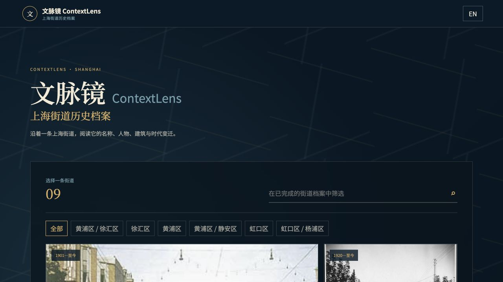
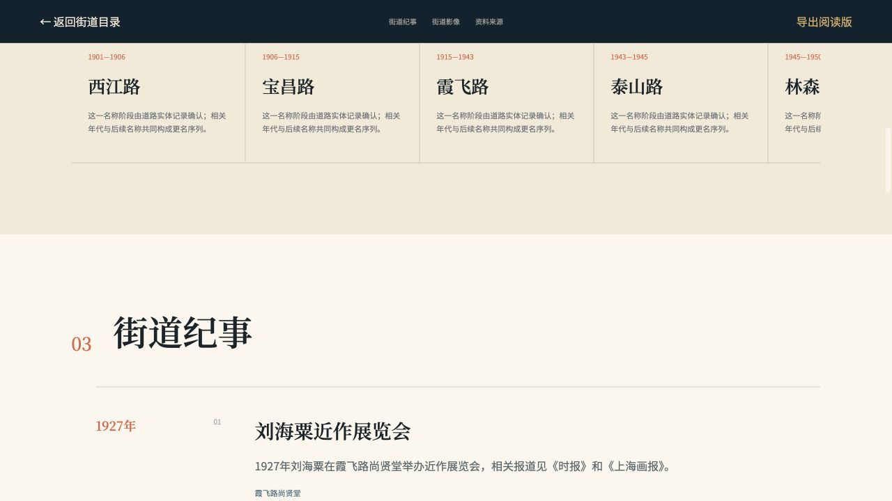
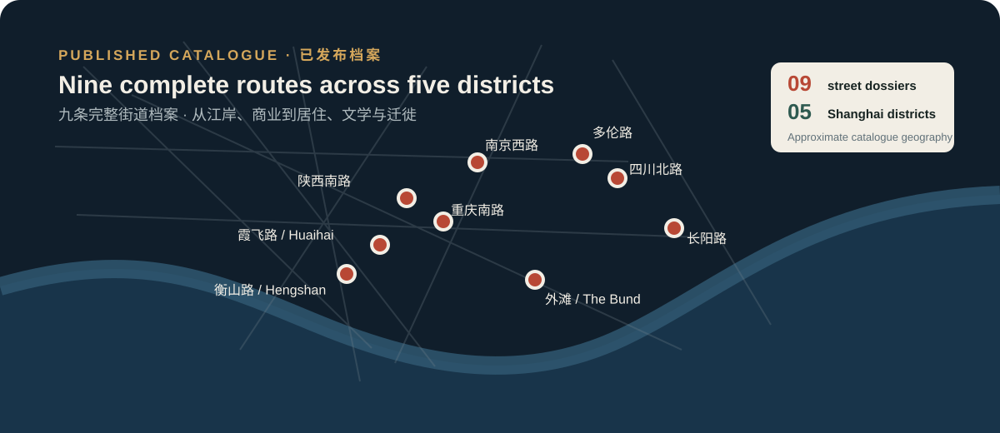
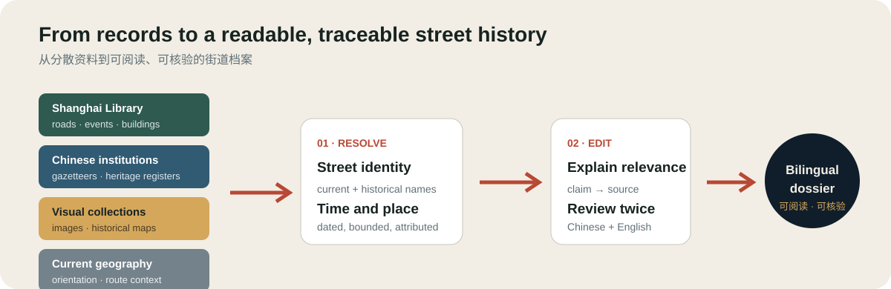
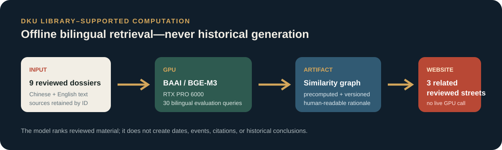
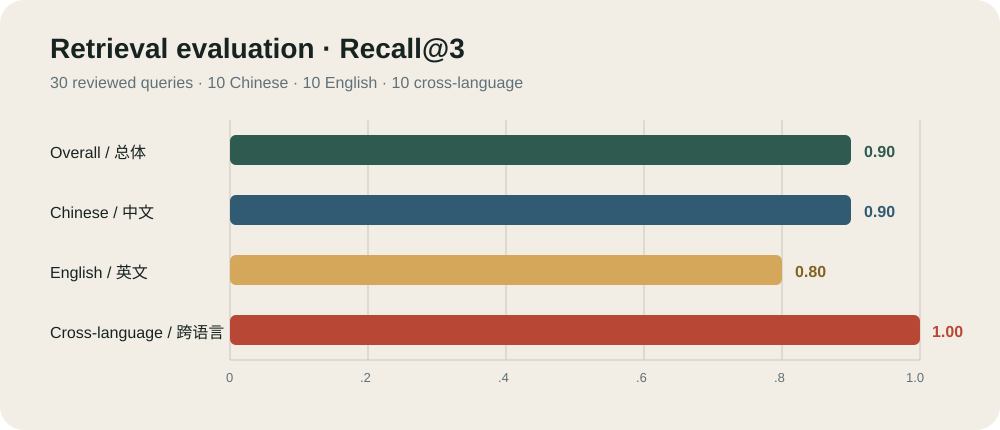
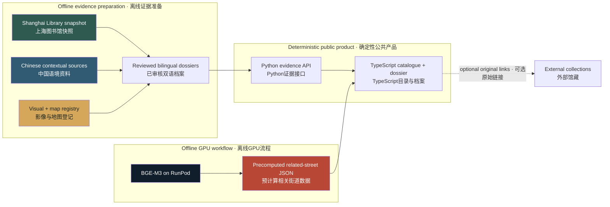

<div align="center">

# 文脉镜 ContextLens

### Shanghai Street History Archive · 上海街道历史档案

**Choose one completed Shanghai street dossier. Follow its names, people, buildings, events, images, maps, and sources in one coherent route.**

**选择一条已完成的上海街道档案，沿着名称、人物、建筑、事件、影像、地图与资料来源，读懂它如何成为今天的样子。**

[](#published-street-catalogue)
[](#the-complete-visitor-route)
[](#evidence-architecture)
[](#publication-gate-and-release-validation)

[项目简介](#contextlens-in-30-seconds) · [产品导览](#product-walkthrough) · [街道目录](#published-street-catalogue) · [证据体系](#evidence-architecture) · [GPU 工作](#gpu-assisted-bilingual-retrieval) · [本地运行](#quick-start)

<table>
  <tr>
    <td width="58%"></td>
    <td width="42%"></td>
  </tr>
</table>

</div>

---

## ContextLens in 30 seconds · 30 秒了解文脉镜

ContextLens is a **bilingual, evidence-backed archive of Shanghai street
histories**. Visitors select one of nine completed dossiers and follow the
street through documented names, dated events, buildings, people, images,
maps, and readable source entries—without losing the historical narrative.

文脉镜是一座**中英双语、以资料为依据的上海街道历史档案**。访客从九条已完成
的街道中选择一条，在同一条阅读路径中追踪路名沿革、历史事件、建筑、人物、
影像、地图与资料来源。

The project deliberately does **not** promise an automatically generated story
for every typed street. It publishes only dossiers that pass a complete-route
standard: no empty required sections, unsupported dates, broken primary
actions, or untraceable visuals.

项目明确**不承诺为任意输入的街道自动生成故事**。只有通过完整体验标准的档案
才会公开：必需章节不得为空，日期必须有依据，主要操作不得失效，影像必须能够
追溯来源。

> **The central proposition:** street history should be readable like a story,
> but inspectable like research.
>
> **核心主张：** 街道历史应当像故事一样易于阅读，同时像研究一样可以核验。

### Why this approach is different · 为什么采用这一方式

| Common street-story approach · 常见街道叙事方式 | ContextLens · 文脉镜 |
|---|---|
| Accept a broad query, even when evidence is thin<br>即使资料不足，也接受宽泛检索 | Offer a curated catalogue of completed dossiers<br>只提供经过审核的完整街道目录 |
| Present an attractive narrative first<br>优先呈现吸引人的叙事 | Reconstruct a reviewed history with its supporting material<br>以资料重建经过审核的历史档案 |
| Collect citations at the end<br>仅在文末集中列出引用 | Explain what each source contributes to the relevant chapter<br>解释每条来源为对应章节提供了什么 |
| Use images as atmosphere<br>把影像作为氛围装饰 | State what every visual shows, why it matters, and where it comes from<br>说明每幅影像展示什么、为何重要、来自哪里 |
| Recommend content by tags or popularity<br>按标签或热度推荐内容 | Rank related reviewed dossiers through offline bilingual semantic comparison<br>通过离线双语语义比较排序相关档案 |
| Hide incomplete cases behind generic output<br>用通用内容掩盖资料缺口 | Keep incomplete streets unpublished until the full route passes<br>完整体验通过前不公开不完整街道 |

## Product walkthrough · 产品导览

<table>
  <tr>
    <td width="33%"><strong>01 · Choose / 选择</strong><br><sub>The catalogue contains only dossiers that complete the public route.<br>目录只收录能够完成全部公共体验的档案。</sub></td>
    <td width="33%"><strong>02 · Read / 阅读</strong><br><sub>Names and dated moments form one continuous street history.<br>路名与有明确年代的节点构成连续历史。</sub></td>
    <td width="33%"><strong>03 · Verify and continue / 核验与延伸</strong><br><sub>Sources support the account; GPU ranking leads to another reviewed dossier.<br>资料支撑叙述，GPU 排序引导至另一条已审核档案。</sub></td>
  </tr>
  <tr>
    <td></td>
    <td></td>
    <td></td>
  </tr>
</table>

## The complete visitor route · 完整访客路径


Each dossier can contain seven reader-facing chapters:

每条档案可包含七个面向读者的章节：

1. **Street overview / 街道概览** — a concise historical interpretation / 简明的历史解读。
2. **Names through time / 名称沿革** — verified name periods in sequence / 按时间排列的可靠名称阶段。
3. **Street chronicle / 街道纪事** — dated events, buildings, institutions, and people / 有明确年代的事件、建筑、机构与人物。
4. **Visual archive / 街道影像** — rights-aware material with item-specific explanations / 附权利信息与逐项说明的影像资料。
5. **Street in the city / 街道与城市** — present-day orientation and a relevant historical map / 当代定位与相关历史地图。
6. **Sources / 资料来源** — readable contributions and original collection entrances / 易读的资料说明与原始馆藏入口。
7. **Continue or export / 延伸阅读或导出** — related reviewed dossiers and a printable edition / 相关已审核档案与可打印阅读版。

## Published street catalogue · 已发布街道目录

<div align="center">
  
</div>

The release contains **nine complete dossiers across five Shanghai districts**.
The catalogue spans commercial, residential, literary, institutional,
migration, financial, and waterfront histories rather than repeating one
central-city archetype.

当前版本包含**覆盖上海五个区的九条完整街道档案**。目录涵盖商业、居住、文学、
公共机构、移民、金融与滨水历史，避免只重复一种中心城区叙事。

| Street dossier · 街道档案 | Coverage · 时间范围 | Historical lens · 历史主题 | District · 区域 |
|---|:---:|---|---|
| **霞飞路 / 淮海中路** · Avenue Joffre / Huaihai Middle Road | 1901–present · 至今 | Six name periods, publishing, art, metropolitan life<br>六个名称阶段、出版、美术与都市生活 | Huangpu / Xuhui · 黄浦 / 徐汇 |
| **衡山路** · Hengshan Road | 1920–present · 至今 | Avenue Pétain, apartments, lane housing, public institutions<br>贝当路、公寓、里弄与公共机构 | Xuhui · 徐汇 |
| **重庆南路** · South Chongqing Road | 1923–present · 至今 | Lane compounds, apartments, residential change<br>里弄、公寓与居住变迁 | Huangpu · 黄浦 |
| **陕西南路** · South Shaanxi Road | 1920–present · 至今 | Garden residences, lanes, historical renaming<br>花园住宅、里弄与历史更名 | Huangpu / Xuhui · 黄浦 / 徐汇 |
| **南京西路** · West Nanjing Road | 1932–present · 至今 | Bubbling Well Road, commerce, hotels, civic culture<br>静安寺路、商业、旅馆与公共文化 | Huangpu / Jing'an · 黄浦 / 静安 |
| **多伦路** · Duolun Road | 1911–present · 至今 | Darroch Road, literary culture, churches, revolutionary sites<br>窦乐安路、文学文化、教堂与革命遗址 | Hongkou · 虹口 |
| **四川北路** · North Sichuan Road | 1925–present · 至今 | Commerce, worker housing, apartments, revolutionary activity<br>商业、职工住宅、公寓与革命活动 | Hongkou · 虹口 |
| **长阳路** · Changyang Road | 1903–present · 至今 | Ward Road, civic institutions, Jewish refuge history<br>华德路、公共机构与犹太难民历史 | Hongkou / Yangpu · 虹口 / 杨浦 |
| **外滩 / 中山东一路** · The Bund / East Zhongshan No. 1 Road | 1869–present · 至今 | River infrastructure, finance, architecture, skyline<br>滨江基础设施、金融、建筑与天际线 | Huangpu · 黄浦 |

The map is an orientation graphic, not a survey map. Approximate positions are
used here because the README explains catalogue scope rather than historical
parcel-level geography.

本图用于说明目录分布，并非测绘地图。README 在此展示的是档案覆盖范围，而非
历史地块级空间精度，因此采用近似位置。

## Flagship demonstration · 旗舰演示：霞飞路 / 淮海中路

The flagship dossier makes the project’s argument visible in one route.

旗舰档案通过一条完整路径直观呈现项目的核心主张。

### Six documented name periods · 六个有据可查的名称阶段

| Period · 时期 | Name · 名称 |
|---:|---|
| 1901–1906 | 西江路 · Rue de Sikiang |
| 1906–1915 | 宝昌路 · Route Paul Brunat |
| 1915–1943 | 霞飞路 · Avenue Joffre |
| 1943–1945 | 泰山路 |
| 1945–1950 | 林森中路 |
| 1950–present | 淮海中路 · Huaihai Middle Road |

### Two evidence-backed historical moments · 两个有资料支撑的历史节点

- **1927 — Liu Haisu’s exhibition / 刘海粟近作展览会.** Shanghai Library’s
  historical-event record places the exhibition at Shangxian Hall on Avenue
  Joffre and preserves references to *Shibao* and *Shanghai Pictorial*.
  **中文：** 上海图书馆历史事件记录将展览地点明确记为霞飞路尚贤堂，并保留
  《时报》与《上海画报》的相关线索。
- **1934 — Kangjian Bookstore / 康健书局.** The event record identifies the
  bookstore at 436 Avenue Joffre, records its founding year, and notes that it
  remained active until 1950.
  **中文：** 事件记录明确康健书局位于霞飞路436号，记载其创办年份，并说明
  书局延续至1950年。

### Recommended live-demo sequence · 建议现场演示顺序

1. Open the catalogue and select **霞飞路 / 淮海中路**. / 打开目录并选择**霞飞路 / 淮海中路**。
2. Follow the six name stages from 1901 to the present. / 追踪1901年至今的六个名称阶段。
3. Read the 1927 exhibition and 1934 bookstore entries. / 阅读1927年展览与1934年书局节点。
4. Inspect the 1930s street image and its rights metadata. / 查看1930年代街景及其权利信息。
5. Open one supporting Shanghai Library source entry. / 打开一条上海图书馆支撑资料。
6. Show the three GPU-ranked related dossiers. / 展示三条由GPU排序的相关档案。
7. Switch the entire interface to English. / 将完整界面切换为英文。
8. Export the reader edition. / 导出阅读版。

The intended conclusion is concrete: **one street becomes an interface for
reading Shanghai’s administrative, cultural, commercial, and spatial history.**

希望读者获得的结论十分明确：**一条街道可以成为理解上海行政、文化、商业与
空间历史的交互界面。**

## Evidence architecture · 证据体系

<div align="center">
  
</div>

### Evidence base at a glance · 证据基础概览

| 154 | 93 | 9 | 0 |
|:---:|:---:|:---:|:---:|
| **packaged official records<br>打包官方记录** | **preserved API responses<br>留存接口响应** | **published dossiers<br>已发布档案** | **seed/demo records in the public evidence path<br>公共证据路径中的演示种子记录** |
| Shanghai Library snapshot<br>上海图书馆快照 | reproducible lineage<br>可复现数据谱系 | complete catalogue routes<br>完整目录路径 | deterministic production data<br>确定性生产数据 |

### Source hierarchy · 来源层级

| Source class · 来源类别 | What it contributes · 提供内容 | How it is used · 使用方式 |
|---|---|---|
| **Shanghai Library open data<br>上海图书馆开放数据** | Road entities, events, buildings, people, institutions, bibliographic entrances<br>道路实体、事件、建筑、人物、机构与书目入口 | Primary identity and historical evidence<br>核心身份与历史证据 |
| **Chinese institutional sources<br>中国机构资料** | Gazetteers, municipal or district history, heritage registers, museum material<br>地方志、市区历史、保护名录与博物馆资料 | Local context and corroboration<br>本地语境与交叉印证 |
| **International visual and cartographic collections<br>国际影像与地图馆藏** | Historical photographs and maps from public institutions<br>公共机构收藏的历史照片与地图 | Attributed visual and spatial interpretation<br>保留署名的视觉与空间解读 |
| **Contemporary geographic infrastructure<br>当代地理基础设施** | OpenStreetMap / OpenFreeMap orientation<br>当代空间定位 | Present-day location, never proof of a historical claim<br>只用于当代定位，不作为历史主张证据 |

Shanghai Library open data remains the project’s evidentiary foundation. The
packaged snapshot allows the demonstration to remain reproducible if a live
provider is temporarily unavailable. Each external entry preserves enough
metadata to locate the collection again when an automated request is blocked
or redirected.

上海图书馆开放数据始终是项目的证据基础。即使在线服务暂时不可用，打包快照仍能
保证演示可复现。每条外部资料都保留足够的元数据，以便在自动访问受阻或发生跳转
时重新定位原馆藏。

### One claim, one inspectable relationship · 一项主张，一条可检查的对应关系

```text
Claim
Kangjian Bookstore was founded in 1934 at 436 Avenue Joffre.
主张
康健书局于1934年创办，地址为霞飞路436号。

Supporting record
Shanghai Historical and Cultural Events Knowledge Base
支撑资料
上海市历史文化事件知识库

Displayed relationship
Dated event + direct street address
呈现关系
有明确年代的事件 + 直接街道门牌

Visitor action
View supporting source → read the contribution → open the collection entrance
访客操作
查看资料依据 → 阅读资料贡献 → 打开原馆藏入口
```

The visitor does not need to read raw JSON to understand the history. At the
same time, the interface does not make an external link substitute for an
on-page explanation.

访客无需阅读原始JSON即可理解历史；与此同时，界面也不会用外部链接代替平台内
应有的解释。

### Visual-rights policy · 影像权利政策

Every embedded image records:

每幅嵌入的影像均记录：

- title and date / 标题与年代；
- creator where known / 已知作者；
- holding institution or provider / 收藏机构或提供方；
- licence and required attribution / 许可与署名要求；
- original source page / 原始来源页面；
- whether the item provides context or direct evidence / 属于语境材料还是直接证据；
- a street-specific explanation of why it is shown / 针对该街道说明采用理由。

For example, the dossier’s 1930s Avenue Joffre photograph is presented with its
Wikimedia Commons record, dating note, creator status, licence information,
and an explanation of the streetscape detail it helps the reader observe.
Material without a defensible embedding right is referenced rather than copied.

例如，档案中的1930年代霞飞路照片同时呈现Wikimedia Commons记录、年代说明、
作者状态、许可信息，以及它帮助读者观察哪些街景细节。对于无法确认嵌入权利的
材料，项目只提供说明与链接，不直接复制。

## GPU-assisted bilingual retrieval · GPU 辅助双语检索

GPU infrastructure funded through **Duke Kunshan University Library** supported
a small, reproducible, project-relevant experiment: bilingual semantic indexing
and retrieval evaluation across the reviewed street dossiers. It was designed
to improve discovery without letting a language model generate history.

由**昆山杜克大学图书馆**经费支持的GPU基础设施用于一项规模适中、可复现且与
项目直接相关的实验：对已审核街道档案进行双语语义索引与检索评估。该实验用于
改善档案发现，不允许语言模型生成历史事实。

<div align="center">
  
</div>

### Why GPU computation was useful · 为什么需要 GPU 计算

Street relationships are not always captured by one shared label. A Chinese
query about Jewish refuge, a mixed-language query containing an old English
road name, and an English query about lane housing may refer to related records
with very different vocabulary. A multilingual embedding model compares those
meanings across Chinese and English more effectively than exact keyword rules.

街道之间的关系并不总能由同一个标签概括。有关犹太难民的中文问题、包含英文旧
路名的混合语言问题，以及有关里弄住宅的英文问题，可能指向用词完全不同但内容
相关的资料。多语言嵌入模型能够跨中英文比较语义，比精确关键词规则更适合这一
任务。

The RunPod job therefore:

因此，RunPod任务完成了以下工作：

1. normalized nine bilingual dossier documents while retaining stable street and source identifiers / 规范化九份双语档案，并保留稳定的街道与来源标识符；
2. encoded them with **BAAI/bge-m3** in an isolated GPU environment / 在隔离的GPU环境中使用**BAAI/bge-m3**编码；
3. evaluated 30 reviewed queries—10 Chinese, 10 English, and 10 cross-language / 评估30条审核问题：中文、英文、跨语言各10条；
4. generated a versioned similarity graph and bilingual relationship reasons / 生成带版本的相似度关系图和双语关系说明；
5. exported machine-readable metrics, rankings, checksums, and hardware data / 导出机器可读的指标、排序、校验值与硬件数据；
6. integrated only the precomputed graph into the public website / 仅将预计算结果接入公共网站。

### Recorded RunPod execution · RunPod 实际运行记录

| Field · 字段 | Recorded value · 实际记录值 |
|---|---|
| GPU | NVIDIA RTX PRO 6000 Blackwell Server Edition |
| GPU memory · 显存 | 94.97 GB |
| Model | `BAAI/bge-m3` |
| Model revision · 模型版本 | `5617a9f61b028005a4858fdac845db406aefb181` |
| CUDA / PyTorch | 12.8 / 2.8.0+cu128 |
| Corpus · 语料 | 9 reviewed bilingual street documents · 9份已审核双语街道文档 |
| Evaluation · 评估集 | 30 queries, balanced across three language groups · 30条问题，三组语言均衡分布 |
| Benchmark repetitions · 基准重复次数 | 10 |
| Peak allocated GPU memory · 峰值分配显存 | 5,052.98 MB |
| Measured model process · 实测模型进程时长 | 13.817 seconds · 秒 |
| Configured Pod rate · Pod配置费率 | US$2.10/hour · 每小时 |

<div align="center">
  
</div>

| Evaluation result · 评估结果 | Recall@1 | Recall@3 | MRR |
|---|---:|---:|---:|
| Overall · 总体 | **0.70** | **0.90** | **0.8173** |
| Chinese · 中文 | 0.70 | 0.90 | 0.8250 |
| English · 英文 | 0.50 | 0.80 | 0.6768 |
| Cross-language · 跨语言 | 0.90 | **1.00** | 0.9500 |

These measurements describe this small reviewed evaluation set; they are not a
claim of general benchmark performance. The measured model process corresponds
to an estimated **US$0.0081** at the configured rate, but this is **not** the
total RunPod invoice. Pod setup, package installation, model download, storage,
idle time, and the provider’s billing ledger must be reported separately.

这些指标仅描述本项目的小规模审核评估集，并不代表通用基准性能。按配置费率估算，
实测模型进程约对应**0.0081美元**，但这**不是**RunPod最终账单。Pod准备、依赖
安装、模型下载、存储、空闲时间及服务商账单记录必须另行统计。

### Historical-safety boundary · 历史内容安全边界

- The GPU does **not** create dates, events, names, citations, or conclusions / GPU**不会**生成日期、事件、名称、引文或历史结论。
- Recommendations remain limited to the nine editorially reviewed dossiers / 推荐范围仅限九条经过编辑审核的档案。
- The website reads a precomputed JSON artifact; it makes no live GPU request / 网站读取预计算JSON，不发起实时GPU请求。
- The public experience works when RunPod and all model services are off / 关闭RunPod及全部模型服务后，公共体验仍可完整运行。
- Every artifact records the corpus checksum and exact model revision / 每项实验产物都记录语料校验值与精确模型版本。

Reproduce or inspect the work:

复现或检查相关工作：

- [GPU experiment report · GPU实验报告](reports/gpu/contextlens_gpu_report.md)
- [RunPod execution manifest · RunPod执行清单](reports/gpu/runpod_run_manifest.json)
- [Ranked retrieval results · 检索排序结果](reports/gpu/retrieval_results.json)
- [Related-street graph · 相关街道关系图](data/processed/gpu_related_streets.json)
- [Reproduction instructions · 复现说明](gpu/README.md)

## System architecture · 系统架构



The architectural boundary is intentional:

这一架构边界是有意设计的：

```text
RunPod GPU → versioned artifact → repository → deterministic website
```

There is no visitor-to-GPU request, no required LLM key, and no generated
historical prose in the public route.

公共体验中不存在访客到GPU的实时请求，不需要LLM密钥，也不包含由模型生成的
历史叙述。

### Repository map · 仓库结构

```text
ContextLens/
├── frontend/src/                 # bilingual catalogue and dossier UI / 双语目录与档案界面
├── app/
│   ├── catalog.py                # public publication manifest / 公开发布清单
│   ├── media_registry.py         # rights-aware visual registry / 影像权利登记
│   ├── place_investigation.py    # resolution and dossier pipeline / 街道解析与档案流程
│   ├── official_snapshot.py      # Shanghai Library snapshot builder / 官方快照构建
│   ├── historical_maps.py        # map catalogue and precision boundaries / 地图目录与精度边界
│   └── memory_web.py             # local application and API / 本地应用与接口
├── data/processed/               # official snapshot + GPU artifacts / 官方快照与GPU产物
├── gpu/                          # reproducible RunPod workflow / 可复现RunPod流程
├── reports/gpu/                  # execution manifest, metrics, report / 执行清单、指标与报告
├── docs/readme/                  # current README visuals / README视觉材料
├── tests/                        # publication, evidence, media, GPU regressions / 回归测试
└── start.py
```

## Publication gate and release validation · 发布门槛与版本验证

A street can appear publicly only when every mandatory condition passes:

一条街道只有通过全部必需条件后才能公开：

- [x] unambiguous catalogue identity / 目录身份明确无歧义；
- [x] meaningful, dated historical material / 具备有意义且年代明确的历史材料；
- [x] sources attached to displayed historical claims / 展示的历史主张均关联资料；
- [x] no empty required chapter or “date unknown” card / 无空白必需章节或“年代待考”卡片；
- [x] usable visual rights and attribution metadata / 影像权利与署名信息可用；
- [x] working internal actions and practical source fallbacks / 内部操作有效，来源具备实用备用路径；
- [x] complete Chinese and English reader-facing content / 中英文读者内容完整；
- [x] successful full-route regression test / 完整路径回归测试通过。

If one mandatory test fails, the street remains unpublished rather than opening
an incomplete public page.

只要任一必需测试失败，该街道就继续保持未发布状态，而不会打开不完整的公共页面。

### Verification commands · 验证命令

```bash
npm run check
npm run build
python3 tests/test_catalog_publication.py
PYTHONPATH=. python3 tests/test_media_registry.py
python3 tests/test_place_investigation.py
python3 tests/test_agent.py
python3 tests/test_gpu_artifacts.py
```

| Validation surface · 验证项目 | Current release · 当前版本 |
|---|:---:|
| TypeScript type check · 类型检查 | ✅ Passed · 通过 |
| Production frontend build · 生产构建 | ✅ Passed · 通过 |
| Nine catalogue routes · 九条目录路径 | ✅ Passed · 通过 |
| Visual-rights registry · 影像权利登记 | ✅ Passed · 通过 |
| Place-investigation regression · 街道研究回归 | ✅ Passed · 通过 |
| Evidence-agent smoke test · 证据代理冒烟测试 | ✅ Passed · 通过 |
| GPU artifact integrity · GPU产物完整性 | ✅ Passed · 通过 |
| Chinese ↔ English catalogue and flagship dossier QA · 中英文目录与旗舰档案检查 | ✅ Passed · 通过 |
| Core operation without an LLM · 无LLM核心运行 | ✅ Supported · 支持 |
| Browser console errors on verified flagship route · 旗舰路径浏览器控制台错误 | **0** |

## Quick start · 快速开始

The packaged experience requires **Python 3.10+**. It does not require a model
key, Shanghai Library API key, Node.js, or GPU access.

打包版本需要**Python 3.10或更高版本**，不需要模型密钥、上海图书馆API密钥、
Node.js或GPU访问权限。

```bash
git clone https://github.com/StableTradeAtlas/ContextLens.git
cd ContextLens
./start-contextlens
```

Open **http://127.0.0.1:8765**.

打开 **http://127.0.0.1:8765**。

| Platform · 平台 | Launcher · 启动器 |
|---|---|
| macOS | `START_HERE_MAC.command` |
| Windows | `START_HERE_WINDOWS.bat` |
| Linux | `START_HERE_LINUX.sh` |

Use another port if needed:

如需使用其他端口：

```bash
CONTEXTLENS_PORT=8777 ./start-contextlens
```

### Frontend development · 前端开发

Node.js is needed only when changing the frontend:

只有修改前端时才需要Node.js：

```bash
npm ci
npm run check
npm run build
```

### Optional GPU reproduction · 可选GPU复现

GPU dependencies are intentionally separate from the standard installation.
See [`gpu/README.md`](gpu/README.md) for the exact RunPod workflow.

GPU依赖与标准安装有意分离。完整RunPod流程请参阅
[`gpu/README.md`](gpu/README.md)。

## Research, privacy, and reliability boundaries · 研究、隐私与可靠性边界

- The application does not request GPS, camera, microphone, or browser-history access / 应用不请求GPS、相机、麦克风或浏览历史权限。
- Query audit logs store irreversible hashes rather than raw addresses / 查询审计日志保存不可逆哈希，而非原始地址。
- Historical map precision is not overstated / 不夸大历史地图的空间精度。
- Missing support is not replaced with an unrelated record / 不用无关记录填补资料缺口。
- A failed external source still leaves useful citation and retrieval metadata / 外部链接失效时仍保留可用的引用与检索信息。
- Credentials remain local and never enter frontend bundles or source URLs / 凭据只保存在本地，不进入前端代码包或来源URL。

## Competition and funding context · 竞赛与资助背景

### Shanghai Library Open Data Contest · 上海图书馆开放数据竞赛

ContextLens is designed for the Shanghai Library Open Data Contest as a focused
public-history interaction: **choose one Shanghai street, follow its documented
transformations, and inspect the sources behind the account.** Shanghai Library
open data is the foundation; lawful, attributed public collections add visual,
cartographic, and contextual depth.

文脉镜面向上海图书馆开放数据竞赛，提供一种聚焦的公共历史交互：**选择一条上海
街道，追踪其有据可查的变迁，并检查叙述背后的资料。**上海图书馆开放数据构成
项目基础；合法且明确署名的公共馆藏进一步补充影像、地图与历史语境。

### Duke Kunshan University Library acknowledgement · 昆山杜克大学图书馆致谢

> GPU infrastructure used for bilingual semantic indexing and retrieval
> evaluation was supported by funding from Duke Kunshan University Library.
> Historical evidence remains grounded in Shanghai Library open data and the
> attributed public collections documented in this repository.
>
> 用于双语语义索引与检索评估的GPU基础设施获得昆山杜克大学图书馆经费支持。
> 历史证据仍以上海图书馆开放数据及本仓库列明出处的公共馆藏为基础。

This acknowledgement describes infrastructure support. It does not imply that
DKU Library endorsed every historical interpretation or source selection.

本致谢仅说明基础设施支持，并不表示昆山杜克大学图书馆认可项目中的每一项历史
解释或资料选择。

## Citation, data, and licence · 引用、数据与许可

Suggested project citation:

建议项目引用格式：

```text
ContextLens Team. ContextLens: Shanghai Street History Archive.
Release 2026-08, https://github.com/StableTradeAtlas/ContextLens.
```

Model citation and documentation: [BAAI/bge-m3](https://huggingface.co/BAAI/bge-m3).

模型引用与文档：[BAAI/bge-m3](https://huggingface.co/BAAI/bge-m3)。

Software code follows the repository licence where provided. Shanghai Library
records, third-party datasets, maps, photographs, and other collection material
retain their original rights and attribution requirements. Repository inclusion
does not transfer ownership of those materials.

软件代码遵循仓库中列明的许可。上海图书馆记录、第三方数据集、地图、照片及其他
馆藏材料保留其原有权利与署名要求；收入本仓库并不转移这些材料的所有权。

---

<div align="center">

### 文脉镜 ContextLens

**Shanghai Street History Archive · 上海街道历史档案**

`Shanghai Library open data / 上海图书馆开放数据` · `Bilingual public history / 双语公共历史` · `Traceable visual sources / 可追溯影像来源` · `GPU-assisted discovery / GPU辅助发现` · `Deterministic core / 确定性核心`

</div>
